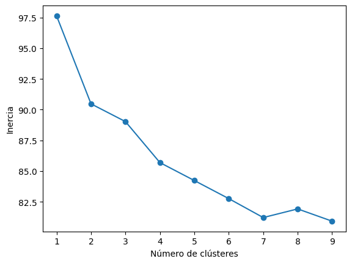

# Practica TID
Autor: Himar Edhey Hérnandez Alonso

## Processing
### Search
En primer lugar hemos hecho una búsqueda avanza en Google filtrando por las palabras france, rat y crazy. A continuación hemos usado el add-on de Firefox Copy `Selected Links` para obtener los enlaces a las páginas más frecuentes dada la búsqueda. Hemos pasado los enlaces a un fichero de texto para procesarlos.

### Links
Para crear nuestro corpus primero limpiamos aquellos enlaces que no nos sirven, como los de youtube o los de traduccion usando:

```bash
grep -v google busqueda.lnk | grep -v youtube | grep "^http" > descargas.lnk
```
En mi caso me he quedado con 136 enlaces en el fichero descargas.lnk

```bash
edhey@Edhey:~/3oIngInformatica/TID/Busquedas/france_rat_crazy$ wc -l descargas.lnk
136 descargas.lnk
```

Con este nuevo archivo de enlaces, hemos procedido a descargar las páginas web usando el siguiente script:

```bash
mkdir html
# * Descargar uno a uno los enlaces de "descargas.lnk" mediante el comando
#   wget ejecutando en consola el siguiente script bash (puede tardar bastante):
rm -r html/*
while read url
do
  FILE=./html/`echo $url | sed -e "s/\//_/g"`.html
  echo "Descargando $url"
  wget -A htm,html,txt,shtml -a descargas.log -O $FILE "$url"
done < descargas.lnk
```

Finalmente eliminamos las páginas que quedaron vacías:
```bash
find html/ -size 0 -exec rm {} \;
```

Lo que nos deja con 110 páginas descargadas:
```bash
edhey@Edhey:~/3oIngInformatica/TID/Busquedas/france_rat_crazy$ ls html | wc -l
110
```

## Corpus
Para crear el corpus primero necesitamos importar las librerías necesarias:
```python

import nltk
import string
import os
import collections

from bs4 import BeautifulSoup
from nltk import word_tokenize
from nltk.stem import PorterStemmer
from nltk.corpus import stopwords
from sklearn.cluster import KMeans
from sklearn.feature_extraction.text import TfidfVectorizer
import sys
```

Descargamos los recursos necesarios de nltk:
```python
nltk.download('stopwords')
nltk.download('punkt')
nltk.download('punk_tab')
```

Leemos los archivos html transformandolos a texto, obteniendo al final el número de archivos leídos:
```bash
edhey@Edhey:~/3oIngInformatica/TID/Busquedas$ python3 nltk_script.py ./france_rat_crazy/
nltk_script.py:59: GuessedAtParserWarning: No parser was explicitly specified, so I'm using the best available HTML parser for this system ("html.parser"). This usually isn't a problem, but if you run this code on another system, or in a different virtual environment, it may use a different parser and behave differently.

The code that caused this warning is on line 59 of the file nltk_script.py. To get rid of this warning, pass the additional argument 'features="html.parser"' to the BeautifulSoup constructor.

  text = BeautifulSoup(html).get_text().encode('ascii', 'ignore')
110
```

## Model
Para crear el modelo tokenizamos el texto y eliminamos los signos de puntuación usando el lenguaje inglés como referencia, aplicando el stemming a las palabras para reducirlas a su raíz. Finalmente usando las palabras vacías (stop words) de nltk, eliminamos las palabras que no nos interesan. Creamos el modelo y al imprimirlo obtenemos el siguiente resultado:
```bash /home/edhey/.local/lib/python3.8/site-packages/sklearn/feature_extraction/text.py:408: UserWarning: Your stop_words may be inconsistent with your preprocessing. Tokenizing the stop words generated tokens ['becau'] not in stop_words.
  warnings.warn(
  (0, 773)      0.013687856955498123
  (0, 530)      0.015227348593411584
  (0, 195)      0.01575073983822462
  (0, 606)      0.01766630422201033
  (0, 747)      0.01200609677504254
  (0, 619)      0.01766630422201033
  (0, 672)      0.010239063510847097
  (0, 593)      0.01295784655666705
  (0, 528)      0.010461874342774817
  (0, 910)      0.01766630422201033
  (0, 552)      0.01295784655666705
  (0, 415)      0.016324050080827556
  (0, 450)      0.01766630422201033
  (0, 734)      0.017301634711233537
  (0, 742)      0.018915297507295613
  (0, 844)      0.016324050080827556
  (0, 763)      0.03206113451089165
  (0, 132)      0.03693904576808915
  (0, 244)      0.014300100697849826
  (0, 262)      0.01766630422201033
  (0, 702)      0.01295784655666705
  (0, 343)      0.038793541559212656
  (0, 429)      0.016324050080827556
  (0, 908)      0.011057926407216836
  (0, 885)      0.01498179593964478
  :     :
  (109, 800)    0.07834197120765433
  (109, 457)    0.016709252174209856
  (109, 52)     0.03813007749183797
  (109, 858)    0.01993185246771877
  (109, 49)     0.0408258428401658
  (109, 468)    0.09069677965965325
  (109, 595)    0.03734299285149164
  (109, 644)    0.04719836602849124
  (109, 36)     0.06573191252289462
  (109, 231)    0.08280550509316996
  (109, 435)    0.01179959150712281
  (109, 14)     0.04195136292718356
  (109, 62)     0.03984397039106909
  (109, 57)     0.05746299362775263
  (109, 848)    0.06478341404260946
  (109, 53)     0.023866881579051567
  (109, 45)     0.024996543361871227
  (109, 10)     0.07325828899807191
  (109, 627)    0.09998617344748491
  (109, 630)    0.016432978130723655
  (109, 35)     0.011413846737687156
  (109, 186)    0.08083991888833114
  (109, 313)    0.01948398798779515
  (109, 223)    0.11817277453200004
  (109, 833)    0.03399561804426697
```
Esto nos indica que el modelo ha sido creado correctamente. Los datos estan en la forma (documento, palabra) y el valor es el peso de la palabra en el documento. Así que el modelo ya está listo para ser usado.

Imprimimos los tokens que hemos seleccionado:

```bash
['0' '000' '01' '02' '03' '04' '05' '06' '07' '09' '1' '10' '100' '11'
 '12' '13' '14' '15' '16' '17' '18' '19' '20' '2010' '2011' '2014' '2015'
 '2016' '2017' '2018' '2019' '2020' '2021' '2022' '2023' '2024' '21' '22'
 '23' '24' '25' '26' '27' '28' '29' '3' '30' '31' '33' '34' '35' '37' '39'
 '4' '40' '42' '43' '5' '50' '500' '53' '56' '6' '60' '7' '8' '9' 'accept'
 'access' 'accord' 'account' 'across' 'act' 'action' 'activ' 'ad' 'addit'
 'address' 'administr' 'advanc' 'affair' 'affect' 'africa' 'age' 'agenc'
 'agenda' 'agre' 'agreement' 'agricultur' 'ahead' 'ai' 'air' 'al' 'alert'
 'allianc' 'allow' 'almost' 'along' 'alp' 'also' 'america' 'american'
 'among' 'analysi' 'anim' 'ann' 'announc' 'annual' 'anoth' 'answer'
 'appli' 'applic' 'appoint' 'approach' 'april' 'archiv' 'area' 'around'
 'arriv' 'art' 'articl' 'artist' 'asia' 'ask' 'assembl' 'assist' 'associ'
 'au' 'august' 'author' 'aux' 'avail' 'award' 'back' 'bank' 'base'
 'beauti' 'becam' 'becom' 'begin' 'behind' 'benefit' 'best' 'better'
 'beyond' 'bodi' 'book' 'border' 'bring' 'british' 'browser' 'build'
 'busi' 'c' 'call' 'canada' 'care' 'career' 'carri' 'case' 'categori'
 'celebr' 'center' 'centr' 'central' 'certain' 'challeng' 'chang' 'charg'
 'charl' 'check' 'choic' 'choos' 'citi' 'citizen' 'civil' 'claim' 'class'
 'click' 'climat' 'close' 'club' 'code' 'collabor' 'collect' 'com' 'come'
 'commit' 'committe' 'common' 'commun' 'compani' 'competit' 'complet'
 'con' 'condit' 'conduct' 'confer' 'confirm' 'conflict' 'connect' 'consid'
 'consist' 'consult' 'contact' 'contain' 'continu' 'contract' 'contribut'
 'control' 'cooki' 'cooper' 'correspond' 'cost' 'council' 'countri'
 'cours' 'court' 'cover' 'creat' 'creation' 'credit' 'crisi' 'cultur'
 'current' 'custom' 'da' 'dan' 'data' 'databas' 'date' 'day' 'death'
 'decemb' 'decis' 'declar' 'del' 'deliv' 'demand' 'depart' 'design'
 'destin' 'detail' 'develop' 'differ' 'digit' 'direct' 'director'
 'directori' 'discov' 'discuss' 'divers' 'document' 'du' 'e' 'earli'
 'east' 'econom' 'economi' 'edit' 'educ' 'effect' 'effort' 'el' 'elect'
 'electr' 'email' 'emerg' 'emmanuel' 'employ' 'employe' 'en' 'enabl' 'end'
 'energi' 'engag' 'england' 'english' 'enjoy' 'ensur' 'enter' 'entr'
 'equal' 'es' 'especi' 'essenti' 'est' 'establish' 'et' 'etc' 'eu' 'europ'
 'european' 'even' 'event' 'everi' 'except' 'execut' 'exist' 'expect'
 'experi' 'expert' 'expertis' 'explor' 'export' 'face' 'fact' 'fair'
 'famili' 'featur' 'februari' 'feedback' 'field' 'figur' 'file' 'fill'
 'final' 'financ' 'financi' 'find' 'first' 'five' 'focu' 'follow' 'food'
 'forc' 'foreign' 'form' 'format' 'former' 'found' 'foundat' 'four'
 'fourth' 'fr' 'franai' 'franais' 'francia' 'free' 'full' 'function'
 'fund' 'futur' 'gain' 'gener' 'geograph' 'germani' 'get' 'give' 'given'
 'global' 'go' 'good' 'gouv' 'govern' 'grand' 'grant' 'great' 'group'
 'growth' 'guarante' 'guid' 'hand' 'hard' 'haut' 'health' 'heart' 'held'
 'help' 'heritag' 'high' 'higher' 'histor' 'histori' 'hold' 'home' 'host'
 'hour' 'hous' 'howev' 'human' 'idea' 'ii' 'imag' 'impact' 'import'
 'improv' 'includ' 'increas' 'independ' 'index' 'indic' 'individu'
 'industri' 'info' 'inform' 'initi' 'innov' 'institut' 'insur' 'integr'
 'intellig' 'interact' 'interest' 'intern' 'introduc' 'invest' 'invit'
 'involv' 'issu' 'itali' 'item' 'januari' 'job' 'join' 'juli' 'june'
 'keep' 'key' 'king' 'kingdom' 'know' 'known' 'l' 'la' 'land' 'languag'
 'larg' 'largest' 'last' 'late' 'later' 'latest' 'launch' 'law' 'le'
 'lead' 'leader' 'learn' 'least' 'leav' 'left' 'legal' 'less' 'level'
 'librari' 'licens' 'life' 'like' 'limit' 'line' 'link' 'list' 'littl'
 'live' 'lo' 'local' 'locat' 'long' 'look' 'lost' 'low' 'macron' 'made'
 'mail' 'main' 'maintain' 'major' 'make' 'manag' 'mani' 'map' 'mar'
 'march' 'mark' 'market' 'materi' 'matter' 'may' 'mean' 'measur' 'media'
 'meet' 'member' 'menu' 'messag' 'method' 'michel' 'middl' 'million'
 'minist' 'ministri' 'mission' 'mobil' 'monitor' 'mont' 'month'
 'montpelli' 'move' 'movement' 'much' 'museum' 'n1' 'n10' 'n2' 'n3' 'n4'
 'n5' 'n6' 'n7' 'n8' 'n9' 'na' 'nabout' 'naccess' 'nall' 'name' 'nan'
 'nat' 'nation' 'national' 'natur' 'navig' 'nbi' 'nbusi' 'ncareer'
 'nchoos' 'nclose' 'ncontact' 'ncontent' 'ncooki' 'ncountri' 'ncreat'
 'ncultur' 'ndata' 'ndiscov' 'ndownload' 'ne' 'nearli' 'nemploy' 'nen'
 'nenglish' 'network' 'nevent' 'new' 'news' 'newslett' 'nexplor' 'next'
 'nfacebook' 'nfaq' 'nfind' 'nfollow' 'nfor' 'nfranc' 'nfrench' 'nfrom'
 'nget' 'ngovern' 'nhelp' 'nhistori' 'nhome' 'nhow' 'ni' 'nif' 'nin'
 'ninform' 'ninstagram' 'nintern' 'njoin' 'nla' 'nlatest' 'nle' 'nlearn'
 'nlegal' 'nlinkedin' 'nmenu' 'nmore' 'nnew' 'nno' 'noffici' 'non' 'nopen'
 'normandi' 'north' 'note' 'nother' 'notic' 'notr' 'nour' 'novemb' 'npari'
 'npress' 'nprivaci' 'npublic' 'nread' 'nreport' 'nresearch' 'nsearch'
 'nsee' 'nservic' 'nsign' 'nskip' 'nsport' 'nsubscrib' 'nsupport' 'nterm'
 'nthi' 'ntop' 'ntwitter' 'number' 'nuse' 'nvideo' 'nview' 'nwe' 'nwelcom'
 'nwhat' 'nwork' 'nyou' 'nyour' 'nyoutub' 'object' 'octob' 'offer' 'offic'
 'offici' 'old' 'one' 'onlin' 'open' 'oper' 'opportun' 'order' 'organ'
 'organis' 'origin' 'outsid' 'overview' 'p' 'pa' 'page' 'paper' 'par'
 'para' 'pari' 'part' 'parti' 'partial' 'particip' 'particular'
 'particularli' 'partner' 'partnership' 'pass' 'past' 'pay' 'peac' 'peopl'
 'per' 'perform' 'period' 'permit' 'person' 'photo' 'pierr' 'place' 'plan'
 'play' 'player' 'pleas' 'plu' 'point' 'polici' 'polit' 'popul' 'popular'
 'portal' 'posit' 'possibl' 'post' 'pour' 'power' 'practic' 'present'
 'presid' 'press' 'prevent' 'prime' 'princip' 'privaci' 'privat' 'process'
 'produc' 'product' 'profession' 'profil' 'program' 'programm' 'project'
 'promot' 'properti' 'protect' 'provid' 'public' 'publish' 'purpos' 'put'
 'qualiti' 'que' 'question' 'r' 'rank' 'rat' 'rate' 'reach' 'read'
 'receiv' 'recent' 'recherch' 'recommend' 'record' 'red' 'reduc' 'refer'
 'region' 'regist' 'registr' 'regul' 'relat' 'releas' 'remain' 'rememb'
 'replac' 'report' 'repres' 'republ' 'request' 'requir' 'research'
 'reserv' 'resid' 'resourc' 'respect' 'respons' 'result' 'return' 'review'
 'right' 'risk' 'role' 'room' 'rule' 'run' 'saint' 'san' 'save' 'say'
 'school' 'scienc' 'scientif' 'se' 'sea' 'search' 'second' 'section'
 'sector' 'secur' 'see' 'sein' 'select' 'septemb' 'seri' 'servic' 'set'
 'sever' 'share' 'shop' 'short' 'show' 'side' 'sign' 'signific' 'sinc'
 'singl' 'site' 'situat' 'size' 'skip' 'small' 'social' 'societi' 'sourc'
 'south' 'space' 'spain' 'special' 'sport' 'staff' 'stage' 'standard'
 'start' 'state' 'statement' 'statist' 'statu' 'stay' 'step' 'still'
 'store' 'stori' 'strategi' 'street' 'strengthen' 'strong' 'structur'
 'student' 'studi' 'subject' 'submit' 'subscrib' 'success' 'suit' 'summer'
 'support' 'sur' 'sustain' 'system' 'tabl' 'take' 'talent' 'talk' 'target'
 'tax' 'team' 'tech' 'technic' 'technolog' 'tell' 'term' 'territori'
 'test' 'text' 'thank' 'thing' 'third' 'threat' 'three' 'throughout'
 'time' 'today' 'togeth' 'tool' 'top' 'topic' 'total' 'tour' 'tourism'
 'toward' 'town' 'trade' 'train' 'transform' 'transit' 'transport'
 'travel' 'tri' 'turn' 'two' 'type' 'u' 'uk' 'ukrain' 'un' 'una'
 'understand' 'une' 'union' 'unit' 'univers' 'updat' 'use' 'user' 'v'
 'valu' 'version' 'via' 'video' 'view' 'visit' 'vou' 'want' 'war' 'warn'
 'way' 'web' 'websit' 'week' 'welcom' 'well' 'went' 'west' 'whether'
 'within' 'without' 'women' 'work' 'world' 'x' 'year' 'youtub' 'zone']
```

Probamos una frase para ver si el modelo funciona correctamente:
```python
sentence = 'Italy has many beautiful cities and animals'
```
Para lo que obtenemos el siguiente resultado:
```bash
mani  -  0.3651117826708274
itali  -  0.4459096869155901
citi  -  0.40040666697792543
beauti  -  0.5100425914828901
anim  -  0.49738213999179465
```

Esto nos indica que el modelo ha sido creado correctamente y que es capaz de identificar las palabras relevantes en una frase.


response = vectorizer.transform([sentence])
for col in response.nonzero()[1]:
    print(feature_names[col], ' - ', response[0, col])


## Clustering
Por último, hemos hecho un clustering de los documentos usando el algoritmo KMeans para 3 grupos. Obteniendo el siguiente resultado:

```bash
2:
   european  -  0.08459889961997337
   archiv  -  0.076815996608126
   origin  -  0.06788185229008163
   king  -  0.06347590146235395

1:
   en  -  0.35052359186901455
   la  -  0.3123031786515634
   del  -  0.2772950578186071
   el  -  0.18331633633753708


0:
   rat  -  0.06355431254955073
   cooki  -  0.04204475868896415
   site  -  0.03645271660053424
   nour  -  0.03543078650847351
```

### Analize results
En el grupo 0 hay palabras reacionadas con rat:
rat, cooki, site, nour
Esto se puede deber a paginas que relacionen rat y france como el personaje de la serie de dibujos animados Ratatouille, que es un ratón que cocina. De ahí la relación con las palabras cooki y site.

En el segundo grupo agrupa palabras en español:
en, la, del, el
Esta salida nos da a entender que algunas páginas están en español, vemos que el algoritmo separó en un grupo aquellas palabras más comunes en este idioma.

Dados los resultamos vemos que en el grupo 2 hay palabras más relacionadas con france:
european, archiv, origin, king
El algoritmo ha agrupado las páginas que tienen que ver con la historia de Francia, ya que a lo largo de su historia ha tenido muchos reyes y reinas, y la historia de Europa está muy relacionada con la historia de Francia.

### Other clusters
Hemos probado a hacer el clustering con 2, 4, 5 y 6 grupos, obteniendo el siguiente resultado:

2. 
```bash
:
   ndiscov  -  0.4981149434896166
   program  -  0.3452234443976409
   programm  -  0.24577226976284935
   studi  -  0.2036726347725815

0:
   en  -  0.0651313952814827
   la  -  0.062216517976923576
   rat  -  0.051622544302259696
   le  -  0.04543968888633389
```

Vemos que ahora  solo agrupa en dos grupos, uno relacionado con la educación y el otro con las palabras en español.

4. 
```bash
1:
   en  -  0.4000834434286343
   del  -  0.3679306185047282
   la  -  0.318927929076574
   el  -  0.24442178178338275

0:
   world  -  0.047226526573829655
   countri  -  0.03927101799376008
   pleas  -  0.03395842606968932
   news  -  0.03281140503546772

3:
   rat  -  0.5259485936415982
   control  -  0.08327781654859116
   care  -  0.06829949612457663
   resourc  -  0.06545335482720986

2:
   le  -  0.17239458119803608
   et  -  0.1196846941006762
   la  -  0.08736634124107949
   cooki  -  0.07840308019899613
```

En este caso vemos que el algoritmo ha agrupado las palabras en español en un grupo, las relacionadas con noticias en otro, uno sobre las ratas como plaga y otro con palabras en francés y cocina.

5. 
```bash
4:
   nfranc  -  0.08173758311732049
   le  -  0.06911580098301763
   war  -  0.06853922791317323
   world  -  0.06755411348040694

3:
   rat  -  0.5259485936415982
   control  -  0.08327781654859116
   care  -  0.06829949612457663
   resourc  -  0.06545335482720986

0:
   et  -  0.12609491380049018
   le  -  0.10943302013157431
   site  -  0.09000096422372829
   nour  -  0.07995210128596374

1:
   en  -  0.4000834434286343
   del  -  0.3679306185047282
   la  -  0.318927929076574
   el  -  0.24442178178338275

2:
   cooki  -  0.05386906229684895
   live  -  0.04003520426821368
   travel  -  0.03797184564315914
   resid  -  0.037630118163962875
```

Para 5 clusters, el algoritmo ha agrupado las palabras en español en un grupo, otro con la plaga de ratas, otro con palabras relacionadas con la guerra y francia (historia), un cuarto  bastante diverso con contenido sobre viajes y cocina y por último otro grupo relacionado con palabras en francés.

6. 
```bash
3:
   live  -  0.37135022045293836
   british  -  0.21860637868274857
   con  -  0.14289044994058028
   life  -  0.12981059818718196

5:
   rat  -  0.3506323957610655
   pleas  -  0.09144393432757185
   tri  -  0.07353073314304223
   technic  -  0.07283557843266925

2:
   cooki  -  0.14610427259998668
   travel  -  0.09398333071020827
   resid  -  0.06751897669058995
   tax  -  0.06396956111626077

1:
   world  -  0.06177905080976542
   countri  -  0.04730489834019346
   le  -  0.04637903082405217
   research  -  0.043454980065265186

4:
   ukrain  -  0.11165428778918231
   macron  -  0.10620571619487919
   nfranc  -  0.0985237714190382
   presid  -  0.09605969219141385

0:
   en  -  0.35052359186901455
   la  -  0.3123031786515634
   del  -  0.2772950578186071
   el  -  0.18331633633753708
```
En este caso el grupo 3 parece centrarse en la vida y aspectos británicos; el grupo 5 destaca términos técnicos y acciones relacionadas con el control; el grupo 2 incluye contenido sobre cookies, viajes y residencia, posiblemente de páginas web; el grupo 1 toca temas globales como países y investigación; el grupo 4 está relacionado con Ucrania, Macron y presidencia, sugiriendo un contexto político; y el grupo 0 reúne textos en español, basado en términos comunes del idioma

### Elbow Method
Para determinar el número óptimo de clusters, se pueden aplicar métodos como el del codo, al hacerlo obtenemos la siguiente gráfica (hemos fijado la aleatoriedad porque si no el resultado cambia cada vez que se ejecuta el algoritmo):


### Conclusiones
El algoritmo KMeans es capaz de agrupar documentos en función de su contenido, y el número óptimo de clusters puede variar según el contexto. En este caso, el método del codo sugiere que 3 o 4 clusters son adecuados para los datos analizados. Al interpretar los datos obtenidos vemos que es razonable el quedarnos con 3/4 clusters, ya que el algoritmo ha creado grupos homogéneos y coherentes.